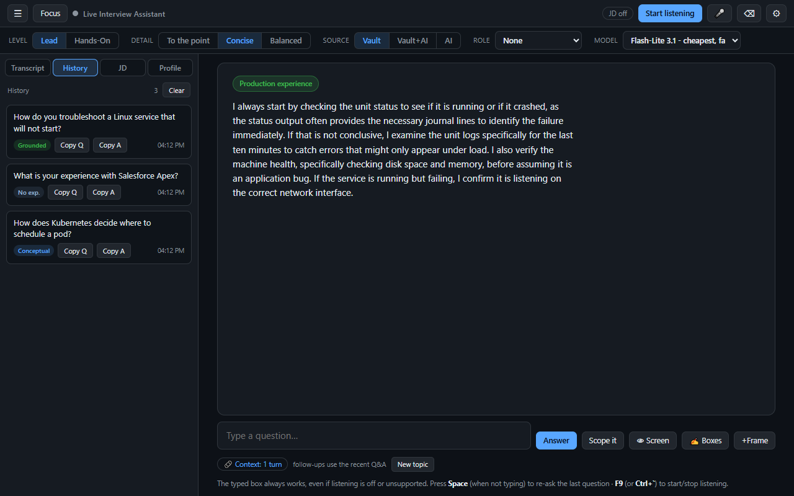
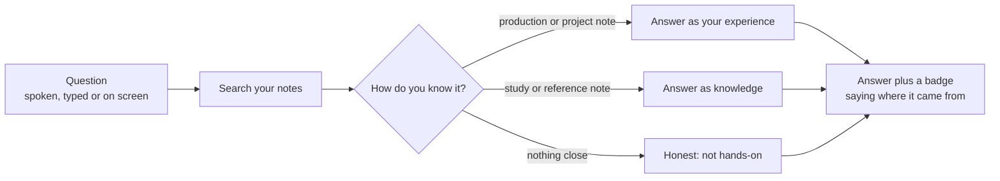
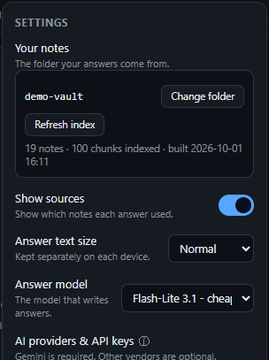
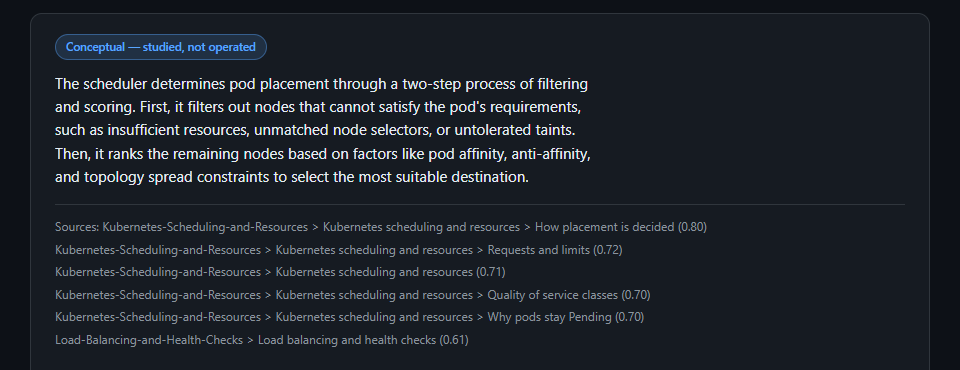
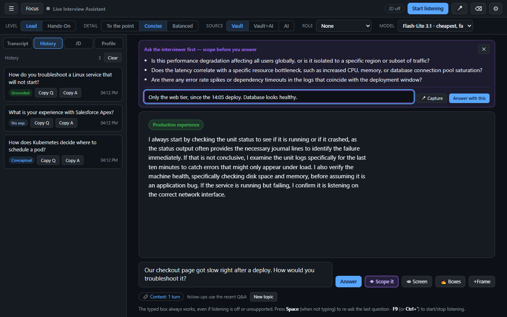
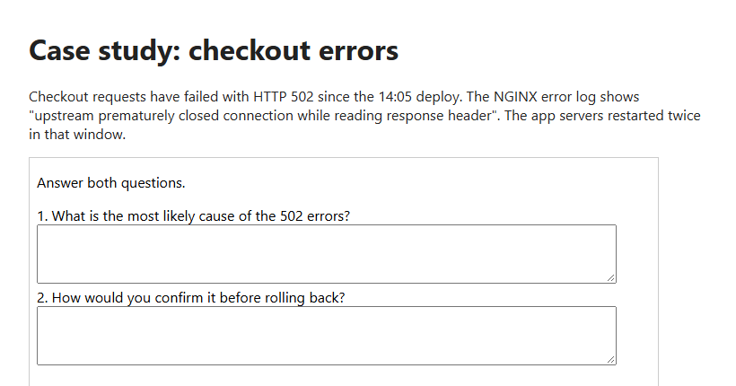
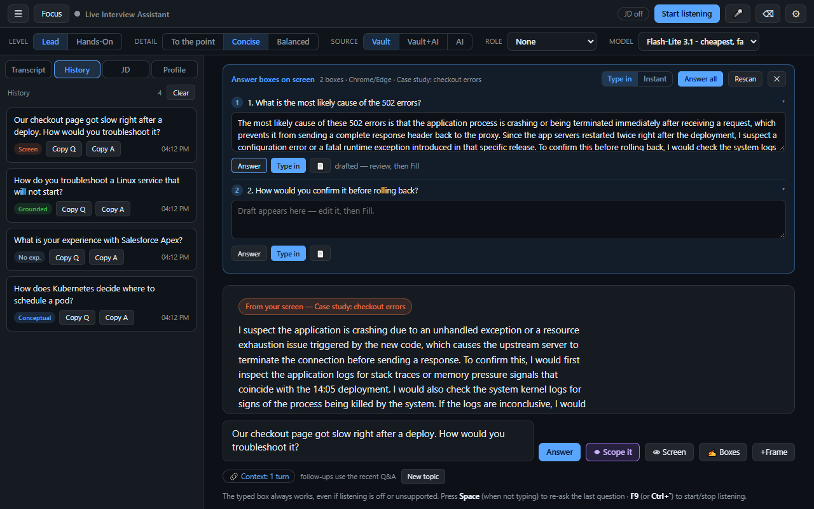
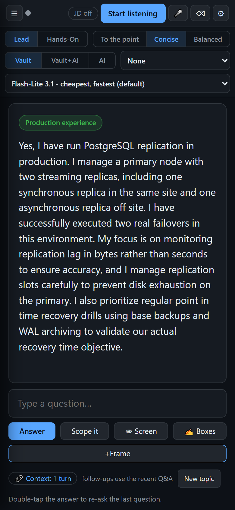

# Live Interview Assistant

A self-hosted recall aid for technical interviews. It answers from **your own notes**, tells you
where each answer came from, says honestly when you have not done something, and costs a few cents
per interview.



---

## Who it is for

You work in IT. Over the years you have built, fixed, migrated and documented far more than anyone
could recall on demand: the outage you led, the firewall policies you wrote, the migration that ran
over a weekend, the course you finished last spring. Then an interviewer asks *"how did you cut the
false positives in your SIEM?"*, and the details are sitting in a note you cannot open in the middle
of a call.

Live Interview Assistant listens to the question, finds the notes you wrote about it, and shows a short
answer in your own voice that you can say out loud. A badge tells you where the answer came from.
When your notes show you have not done something, it says so instead of inventing it.

It works best for people who keep notes in Markdown, for example in Obsidian. If you have not written
anything down yet, you can [start with just your CV](#or-start-with-just-your-cv).

---

## How it works



Every note carries a tier that says **how you know it**: `production`, `project`, `study` or
`reference`. You set it once per folder. The tier of the note that answers a question is a hard limit
enforced in code, not a polite request in a prompt. A study note can be explained, but it can never
be presented as something you ran in production, however good the match.

| | A general chatbot | Live Interview Assistant |
|---|---|---|
| Where facts come from | The model's training data | Your notes, searched for each question, plus your CV |
| When it does not know | Writes something plausible | Says you have no hands-on experience with it |
| Studied versus done | No difference | Every answer is capped by how you know its source |
| Where an answer came from | Not shown | A badge on every answer, and the notes it used if you want them |

---

## Compared with Final Round AI

Final Round AI is a well-known interview copilot. The facts below come from its
[pricing page](https://www.finalroundai.com/pricing) on 1 October 2026.

| | Final Round AI | Live Interview Assistant |
|---|---|---|
| **Price** | Free plan without the live copilot. Live sessions need Pro, from $25 a month, with no free trial | Free and open source. You pay your AI provider per use: about **15 cents** for a 45-minute interview on the default model |
| **What answers draw on** | Your resume and the materials you add | Your own notes, searched for each question, and your CV. General AI knowledge only if you switch it on |
| **Second screen** | Supports phone screens through another device | The same live session on your phone, over your own Wi-Fi |
| **Questions shown on screen** | Screen help with auto-capture | Reads the page's text in Chrome or Firefox, falls back to a screenshot, and drafts answers into the page's answer boxes for you to review |
| **Where it runs** | Their desktop app and service | Your own computer. Your notes and CV go only to the AI provider you choose, with each question |

What you can change **between questions**, with one tap on the controls strip:

- **Level:** *Lead* answers with the checkpoints and decisions, leaving out exact commands and
  product names unless asked. *Hands-On* gives the commands and tools.
- **Detail:** *To the point* (one sentence, which is what a real answer usually is), *Concise* (a
  short spoken paragraph) or *Balanced* (specific bullet points).
- **Source:** *Vault* (your notes only), *Vault+AI* (general knowledge only where your notes have
  nothing) or *AI* (general knowledge for everything, preferring your notes).
- **Role:** an optional lens (architect, security, or GRC and audit) that changes which of your real
  experience leads.
- **Model:** any Gemini, Claude, OpenAI, DeepSeek, Moonshot or OpenRouter model you have a key for.

> [!NOTE]
> Plans and features change. Check Final Round AI's own site for its current details.

---

## What "vault" means here

Your **vault** is simply the folder that holds your notes. It can be an
[Obsidian](https://obsidian.md) vault, a Logseq or Foam folder, a Git repository of documentation,
or any ordinary folder you keep notes in. The app reads every note inside it, including subfolders,
and never changes them.

> [!IMPORTANT]
> **The app reads Markdown files (`.md`) only.** PDFs, Word documents, slides, spreadsheets and
> images in the folder are skipped, so a folder of PDFs indexes as empty. Convert anything you want
> the app to know into Markdown first. Your CV is the one exception: import it as PDF, Word, Markdown
> or text in the **Profile** tab, and the app converts it for you.

> [!TIP]
> Folders named `.obsidian`, `.trash`, `.git` and `templates` are skipped automatically. To leave
> out anything else, such as a folder of personal journals, list it under `vault_exclude` in
> `config.json`.

---

## Try it with the demo vault

A [demo vault](demo-vault/) ships with the repository: 19 notes from a fictional infrastructure
engineer, Sam Rivera, spread across all four tiers, with a matching config and CV. Every screenshot
in this README comes from it.

```bash
copy demo-vault\config.demo.json config.json
python interview_assistant.py --build-index
python interview_assistant.py --ask "How do you troubleshoot a Linux service that will not start?"
```

It indexes in a few seconds for well under a cent. The [demo README](demo-vault/README.md) lists five
questions that show the different kinds of answer, including the two most tools get wrong: an honest
*"I have not run Kubernetes in production"* when asked directly, and a plain no on a topic the notes
never cover. You need a Gemini key first (step 3 below).

### Or start with just your CV

You can use the app before you have written a single note. Import your CV in the **Profile** tab and
skip building an index. Until you add notes, the CV is the only evidence of what you have done:

- Questions about you ("tell me about yourself", "why did you leave") and about your own past work
  ("how did you cut alert noise") are answered from your CV, under a **From your CV** badge. Nothing
  the CV does not state is added, so a question it has no example for gets your approach, never an
  invented story.
- "Have you used X?" is answered from the CV too: yes when a job lists it, "in a project, not in
  production" when only a project does, and an honest no otherwise.
- Technical questions ("how does DNS work") get an honest "no hands-on experience" under the default
  **Vault** source. Switch **Source** to **Vault+AI** and they get a general answer instead, under an
  orange badge so you always know it did not come from you.

Notes make every answer richer, and the app switches to them the moment you build an index.

---

## Install and set up

Tested on Windows 10 with Python 3.13. See [Platform support](#platform-support) for other systems.

> [!NOTE]
> **Built and tested on Windows.** The core (index, answers, web UI) is plain Python and portable,
> but interviewer transcription uses WASAPI loopback and the global hotkeys use Windows APIs.

**1. Get the code** by cloning or downloading this repository, then open a terminal in its folder.

**2. Install the dependencies.**

```bash
pip install -r requirements.txt
```

That one file installs everything, so every feature works.

> [!NOTE]
> If a package is missing, the app still starts. The console and the top of **Settings** both name
> the features that are off and give you the command above to turn them on.

**3. Get a Gemini API key** at [aistudio.google.com/apikey](https://aistudio.google.com/apikey).
Gemini is required: it reads your notes, transcribes the interviewer and answers by default. Keys for
Claude, OpenAI and the others are optional. There are two ways to give the key to the app, and you
only need one.

- **An environment variable (recommended).** Nothing is written to disk.

  ```bash
  setx INTERVIEW_ASSISTANT_GEMINI_KEY "your-key-here"
  ```

  Then open a **new** terminal, because `setx` only affects terminals started after it.

- **In the app.** Start it (step 6) and open **Settings → AI providers & API keys**. On a first run
  with no key, the app opens that box for you. Paste the key and press **Save**. It is checked before
  it is kept, so a mistyped key is refused on the spot. Left as it is, the key lasts until the app
  stops. Tick **Remember on this machine** to keep it for next time.

> [!WARNING]
> **Remember on this machine** saves the key in `api_keys.json` in the app's folder, as **plain
> text**. It is easy, and the file is git-ignored so it never ends up in a commit, but anyone who can
> read files on your computer can read the key. The environment variable is the safer choice.

> [!TIP]
> Create a **Google Cloud project of its own** for this key and set a spending cap on it. The app's
> cost then stays visible and capped separately from anything else you run. If the cap is reached,
> the app tells you so in plain words.

> [!NOTE]
> The variable is deliberately called `INTERVIEW_ASSISTANT_GEMINI_KEY`, not the usual
> `GEMINI_API_KEY`, so the app can never quietly spend a key another tool on your machine set up.
> When the variable is set, it wins over a key entered in the app.

**4. Point it at your notes.**

```bash
copy config.example.json config.json
```

Then set `interview.vault_path` to your notes folder. Every other setting has a working default and
is explained inside the file. The app needs `config.json` to exist, but if you would rather not edit
it, leave the folder for now and use **Settings → Your notes** once the app is running: it takes a
folder (with a Browse button), counts your notes, tells you what the first build will cost, and
builds the index for you.



**5. Build the index.**

```bash
python interview_assistant.py --build-index
```

The first build of a large vault takes a while, because it embeds one chunk at a time: about an hour
and 46 cents for 12,000 chunks. It tells you the estimate before it starts, and every progress line
shows the rate, the time left and the cost so far. An interrupted build resumes where it stopped, and
later builds only pay for notes that changed, usually a few cents.

**6. Start it.**

```bash
python interview_assistant.py --serve
```

Open <http://localhost:8765>.

---

## Your first interview

### Before the call

- **Profile tab:** import your CV, then add the position with its job description and press
  **Use**. The job description steers which of your real experience comes first. It never adds facts.
- **Set your defaults** on the controls strip: *Lead* or *Hands-On*, and a detail level. You can
  change both between questions.
- **Optional:** put the session on your phone (see [On your phone](#on-your-phone)).

### When a question is asked

Press **Start listening** (or `F9`) and the app transcribes the interviewer from your speakers. Each
question appears in the **Transcript** with an **Answer this** button, or you can type a question
and press Enter. The answer appears with a badge:

| Badge | What it means |
|---|---|
| **Production experience** or **Project experience** | Drawn from notes about work you did |
| **Conceptual** | Drawn from study notes: explained as knowledge, never as hands-on work |
| **Reference** | Drawn from reference material |
| **From your CV** | Answered from your CV |
| **No direct experience** | Nothing in your notes covers it, so the answer says so honestly |
| **AI answer** (orange) | General AI knowledge, used only when you choose Vault+AI or AI |
| **From your screen** (orange) | Answered from the question shown on your screen |



> [!TIP]
> Turn on **Show sources** in Settings to see exactly which notes each answer used, as above.

### Vague or open-ended questions: Scope it

Some questions cannot be answered well cold: *"our checkout page got slow after a deploy, what would
you do?"* A strong candidate asks a question or two first. Press **Scope it** and the app suggests
two or three clarifying questions to ask the interviewer.

Type what the interviewer tells you into the box, or press **Capture** and their replies are
transcribed straight into it as they speak. Then press **Answer with this**, and the original question
is answered again with those details included.



> [!TIP]
> Turn on **Scope cue** in Settings and the **Scope it** button turns purple with a ◆ whenever a
> question is the kind worth scoping first: troubleshooting, outages, recovery and design.

### Questions shown on screen

Some interviews put the question on screen: a query to review, a case study, a set of answer boxes.
Open the interview in a browser started with `start-interview-chrome.bat` or
`start-interview-firefox.bat`, then press **Screen** (or `Ctrl+Alt+S` from anywhere). The app reads
the page's text, including content inside frames, and answers from it. When the page cannot be read
as text, it takes a screenshot instead and the badge says so.

**Boxes** finds the answer fields on the page and drafts an answer for each. Nothing goes into the
page until you have read the draft, edited it if you like, and pressed the fill button. It can enter
the text gradually, which some code editors handle better and which gives you a moment to stop a
draft heading into the wrong box, or all at once. Every fill is read back to confirm it landed.





> [!TIP]
> For a case study longer than one screen, press **+Frame** (or `Ctrl+Alt+D`) as you scroll, and the
> next screen answer uses every frame. If Google refuses to sign you in to Firefox, run
> `start-interview-firefox.bat login` once to sign in, then start it normally.

### On your phone

Start the app with `--lan` and open the pairing page (`/pair`) to scan a QR code with your phone.
The phone shows the same live session as the laptop: answers stream to both, and either can ask.
Add `--https` so the phone can install it as an app and keep its screen on.

```bash
python interview_assistant.py --serve --lan --https
```



> [!WARNING]
> `--lan` makes the app reachable on your local network, behind a per-run access token. Only use
> it on a network you trust, because it exposes your notes and an endpoint that spends your API
> credit.

---

## Keyboard shortcuts

There are two kinds. The first three work anywhere on your computer, even when the app is hidden
behind the video call or a shared screen. The rest work while the app's window is in front.

**Anywhere on your computer.** These need the `pynput` package, which `requirements.txt` installs.

| Keys | What it does |
|---|---|
| `Ctrl+Alt+A` | Answers the question the interviewer just asked, the newest line in the transcript. Listening has to be on. |
| `Ctrl+Alt+S` | Reads the question on your screen (code to review, a case study) and answers it. It works even when nothing was said out loud. |
| `Ctrl+Alt+D` | Adds one more screenshot to the next screen answer without answering yet. Use it to scroll through a case study longer than one screen, up to 4 shots. |

**In the app window.**

| Keys | What it does |
|---|---|
| `F9` or `` Ctrl+` `` | Starts or stops listening to the interviewer. It works even while you are typing. |
| `Ctrl+Enter` | Answers the newest transcribed question, and shows which one it picked. With the **Scope it** panel open, it presses **Answer with this** instead. |
| `Enter` | Sends what you typed, in the question box or the Scope it box. `Shift+Enter` starts a new line. |
| `Space` | Asks the last question again. It only does this when nothing is selected, so it never takes over a button you just clicked. |
| `Esc` | Closes Settings, the Scope it panel or the answer boxes panel. |

On the phone there is no keyboard, so double-tap the answer to ask the last question again.

---

## Choosing a model

The default, **Gemini 3.1 Flash-Lite**, is the cheapest and the fastest: the first words appear in
about a second. Your notes do most of the work, so a bigger model rarely gives a better answer.
**Gemini 3.5 Flash** is a sensible step up for a hard question. **Gemini Pro** takes about six
seconds before its first word, which is a long pause in an interview. Claude models (Haiku 4.5,
Sonnet 5, Opus 5) and others appear in the same list once you add their keys in Settings.

Before you rely on a cheap, free or open-weight model in a live interview, check two things.

- **Speed.** The answer has to start appearing while the interviewer is still finishing, which leaves
  little room. A routing service adds a hop, free tiers can queue your request, and models that
  "think" before answering spend seconds doing it. Run `python interview_assistant.py --benchmark` to
  time the selected model before an interview, not during one.
- **Privacy.** Every answer sends the matching chunks of your notes and your whole CV to the provider
  you selected. Free tiers often pay for themselves by training on that traffic. If your notes
  describe an employer's internal systems, the provider you choose is a data decision, not just a
  price. A paid plan from a cheap provider usually gives you most of the saving with far better
  terms.

---

## Costs

On the default model, measured on a real vault and CV:

| | Cost |
|---|---|
| One answer | about 0.15 cents |
| **A 45-minute interview** (40 answers, listening on) | **about 15 cents** (about 35 cents with Claude Haiku 4.5 writing the answers) |
| One hour of listening | about 12 cents |
| First index build of a large vault (12,000 chunks) | about 46 cents, once. Later builds cost cents |

Listening is the one cost that adds up while nobody is asking anything, because audio playing with
listening left on is transcribed continuously. The app stops listening on its own after 90 minutes,
or after 10 minutes of silence, and the header shows a live cost meter.

> [!TIP]
> Set a spending cap on the project in Google Cloud. There is deliberately no budget inside the app:
> the cap at the provider is the one that cannot be bypassed.

---

## Privacy

Everything stays on your computer except the calls to the AI provider:

- **For each answer:** the question, the few note chunks that match it, your CV and the job
  description go to the answer model you selected.
- **While listening:** the interviewer's audio goes to Gemini for transcription.
- **The optional browser mic** (for your own voice) uses your browser vendor's speech service.

The app sends nothing anywhere else and collects no usage data. `--serve` only listens on your own
computer unless you add `--lan`.

Your personal files are git-ignored so they never end up in a commit: `config.json`,
`api_keys.json`, `profiles.json`, `resumes/`, `job_description.md`, `ui_settings.json`, the index and
the generated TLS keys.

---

## Responsible use

This is a recall aid for **your own** experience. It is built to be honest: it will not claim
experience your notes and CV do not show, and its badge always says where an answer came from.

Interviews differ in what they allow. Some welcome notes, some forbid any assistance. Where an
interview's rules prohibit help, this tool does not exempt you from them, and what you do with it is
your responsibility.

---

## Platform support

| | Status |
|---|---|
| Index, retrieval, answers, web UI, phone mirror | Portable Python, no Windows APIs |
| Interviewer transcription | **Windows only** (WASAPI loopback through `soundcard`) |
| Global hotkeys | Tested on Windows (`pynput` supports other systems) |
| Screenshot fallback | Pillow `ImageGrab`, which needs a different capture path elsewhere |
| Reading the screen (CDP and WebDriver BiDi) | Browser protocols, so it should be portable, but untested off Windows |

It is developed and tested on Windows 10. A Linux port most likely means a PulseAudio or PipeWire
monitor capture behind the same `LoopbackTranscriber` interface. Contributions are welcome.

---

## Files and commands

| File | What it is |
|---|---|
| `interview_assistant.py` | The index builder, the command line and the local server |
| `interview_overlay.html` | The whole user interface |
| `requirements.txt` | Every package any feature uses |
| `config.example.json` | The documented settings template. Copy it to `config.json` |
| `demo-vault/` | A fictional engineer's notes, so you can try it before pointing it at your own |
| `reference-notes/` | Optional framework notes for lead-level questions, and the Scope it question bank |
| `HOW-TO-INTERVIEW-ASSISTANT.md` | Day-to-day use and tuning |
| `CLAUDE.md` | How it works inside, and what not to break |

```
python interview_assistant.py --build-index    # build or refresh the index (embeds only changes)
python interview_assistant.py --rebuild        # full re-embed (only after changing the embedding model)
python interview_assistant.py --ask "..."      # one answer in the terminal
python interview_assistant.py --serve          # the app at http://localhost:8765
python interview_assistant.py --serve --lan --https   # plus the phone
python interview_assistant.py --benchmark      # time the selected model
python interview_assistant.py --preview-tiers  # check which tier each note gets, before a rebuild
```

---

## Contributing

Read [CLAUDE.md](CLAUDE.md) first: it explains the design rules and the mistakes already made once.
After a change to the interface or an endpoint, run `python qa/frontend_check.py`, which clicks
through the real app in a browser sandbox for about two cents. Before a release, run
`python qa/release_check.py`, which tests a clean clone the way a new user meets it.

---

## License

[MIT](LICENSE). Use it, change it, share it, and keep the copyright notice.

The demo vault is original content written for this repository. **Sam Rivera is fictional**, and no
part of it comes from anyone's course material or private notes.
